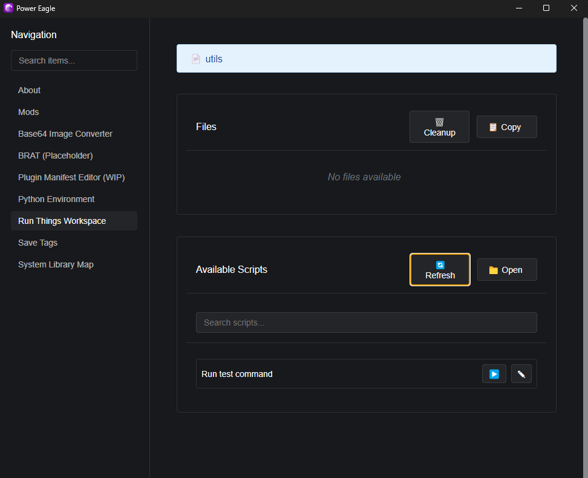
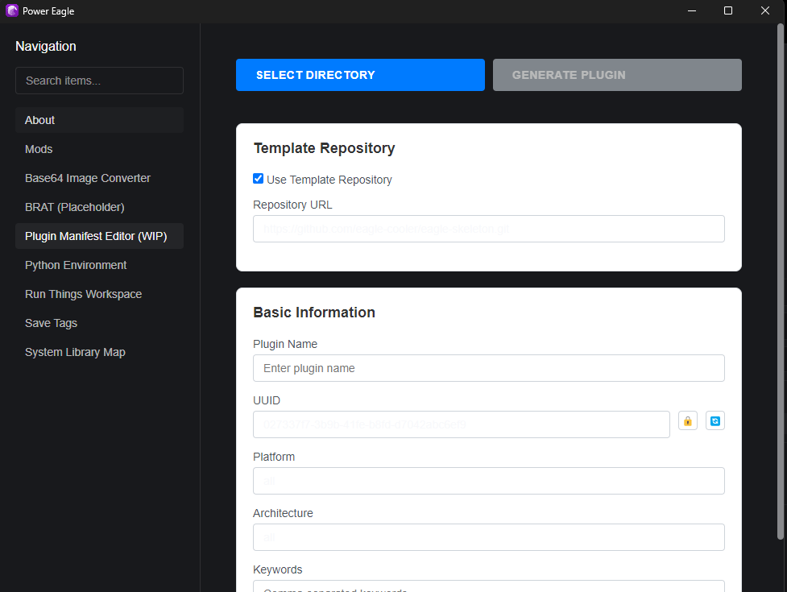
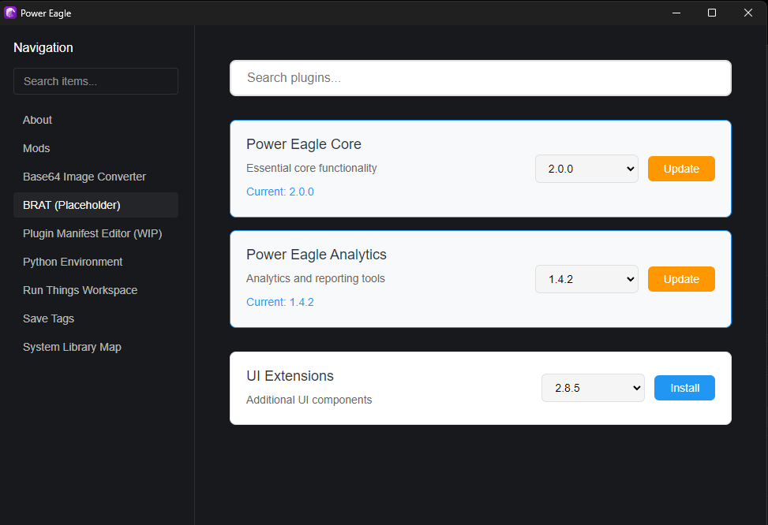
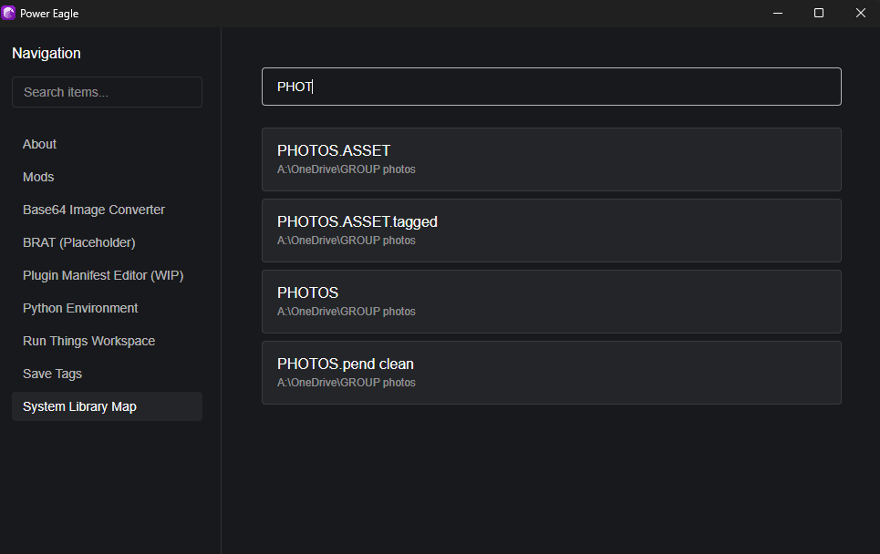
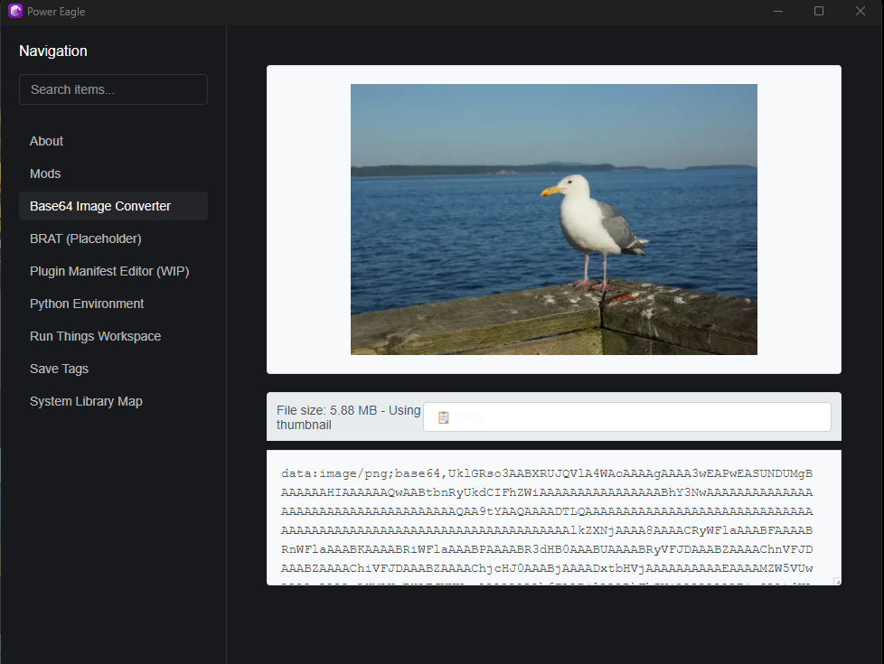
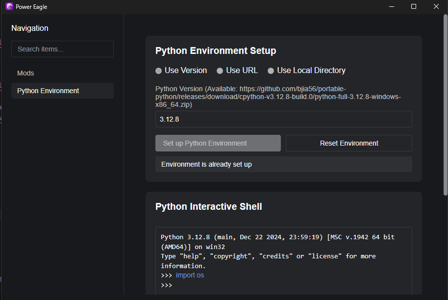

# Power Eagle

Power Eagle is an Eagle plugin inspired by PowerToys that adds a collection of power user and developer tools. Unlike traditional plugins, Power Eagle acts as a meta-plugin that provides additional tooling capabilities through a tab-sized interface, allowing users to extend functionality without creating full plugins for simple tasks.

## 🚀 Features
- **Modular Design**: Easily extendable through mods and mod packages
- **Built-in Tools**: Comes with several useful built-in mods
- **Developer Friendly**: Simple mod creation process
- **Package Management**: Support for installing mods and mod packages

## 📋 Prerequisites
- Git (Required for Power Eagle to function)
- Windows OS (Some features like es-query-library are Windows-only)

## 🎯 Built-in Mods
### About Page
- Displays real-time status information
- Shows current library, selected items, and folder information

### Run Things Workspace
- Script runner with embedded file support
- Perfect for one-off scripts and quick automations
- Supports file filtering and custom actions



### Plugin Development Tools (Coming Soon)
- Step-by-step guided plugin generation



### BRAT (Coming Soon)
- bringing over the BRAT system from Obsidian



## 🔧 Official Mod Extension 
url: [https://github.com/eagle-cooler/power-eagle-mods](https://github.com/eagle-cooler/power-eagle-mods)

### System Library Map (es-query-library)
- Windows-only feature
- Maps all .library folders using es.exe (everything)



### Base64 Image Converter (img-to-base64)
- Convert images to base64 format
- Streamlined image processing



### Python Environment (python-env)
- allows you to setup an embedded python environment
- currently very experimental but in the future will allow you to run python in plugins



## 💻 How to Create a Mod

Here's a basic example of a mod structure:

- `render` can be either a path to a html file or a function that returns a string
- `styles` an array of css strings
- `mount` a function for the main control
- `onLibraryChanged` optional handler for when the library changes
- `onItemChanged` optional handler for when the item changes    
- `onFolderChanged` optional handler for when the folder changes

```javascript
const myMod = {
    name: 'ModName',
    styles: ['styles.css'],
    render: () => `
        // Your HTML template
    `,
    mount: async (container) => {
        // Initialization code
        return () => {
            // Cleanup code
        };
    },
    // Event handlers
    onLibraryChanged: (newPath, oldPath) => {
        // Handle library changes
    }
};
```

## 📦 Utility Package
The [@eagle-cooler/utils](https://www.npmjs.com/package/@eagle-cooler/utils) package is available on npm to aid in plugin development.

## 🔗 Related Projects

- [Power Eagle Base Plugin](https://github.com/eagle-cooler/power-eagle)
- [Power Eagle Mods](https://github.com/eagle-cooler/power-eagle-mods)
- [Example Mod: Eissar SaveTags](https://github.com/eagle-cooler/eissar-savetags-mod)
- [Plugin Template: Eagle Skeleton](https://github.com/eagle-cooler/eagle-skeleton)

## 🛠️ Run Things Workspace

The Run Things Workspace feature allows you to create and run scripts without building full plugins. Scripts can be filtered based on file types, folders, or naming patterns.

Example script structure:
```javascript
module.exports = {
    filter: function(item) {
        // Define when this script should be available
        return itemPath.endsWith('.jpg') || itemPath.endsWith('.png');
    },
    run: async function({ eagle, item, itemPath }) {
        // Your script logic here
    }
};
```

## 📝 Plugin Repository Format

For the plugin repository system:

```json
{
    "name": "plugin-name",
    "git": "repository-url",
    "versions": [
        "1.0.0",
        "1.0.1"
    ]
}
```

## 🤝 Contributing

Contributions are welcome! Feel free to submit pull requests or create issues for bugs and feature requests.

## 📄 License 

This project is licensed under the GNU General Public License v3.0 (GPLv3), meaning you can use, modify, and distribute the code as long as you provide attribution and share your changes under the same license.

